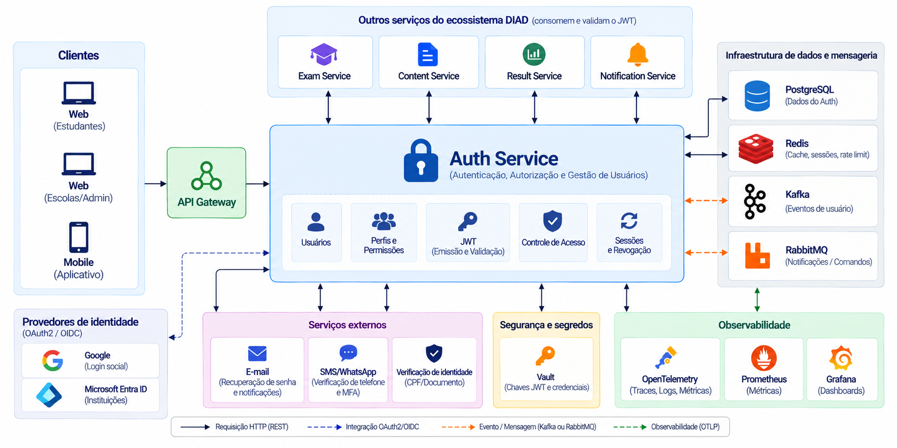
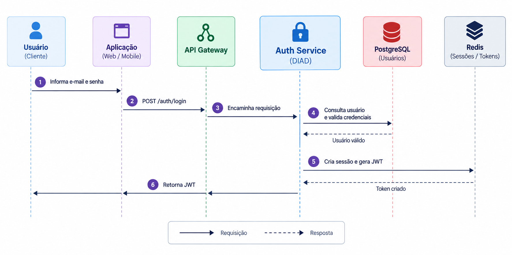
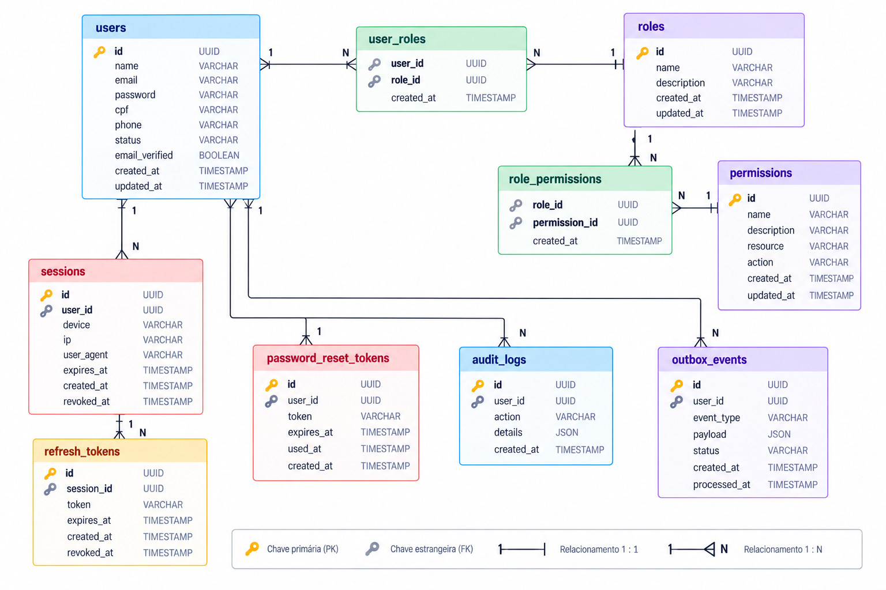
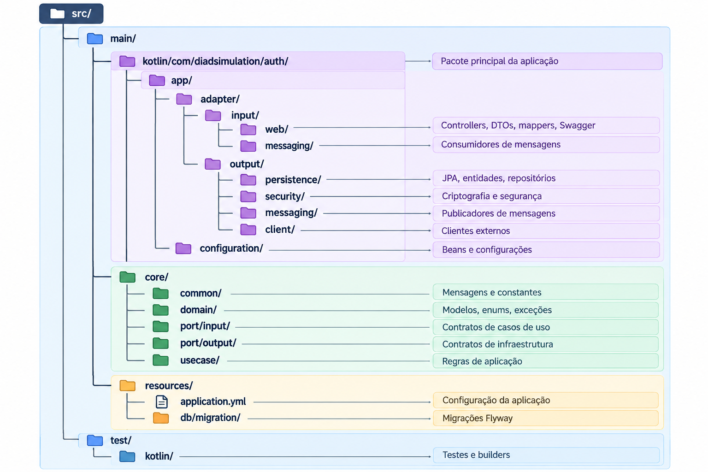

# DIAD Auth Service

**Serviço central de identidade, autenticação e autorização do ecossistema DIAD Simulation.**

## Sumário

1. [Visão geral](#visão-geral)
2. [Funcionalidades](#funcionalidades)
3. [Tecnologias](#tecnologias)
4. [Arquitetura da solução](#arquitetura-da-solução)
5. [Integração entre serviços](#integração-entre-serviços)
6. [Modelagem de dados](#modelagem-de-dados)
7. [Autenticação e autorização](#autenticação-e-autorização)
8. [API REST e Swagger](#api-rest-e-swagger)
9. [Estrutura do projeto](#estrutura-do-projeto)
10. [Pré-requisitos](#pré-requisitos)
11. [Execução local](#execução-local)
12. [Docker](#docker)
13. [Configurações](#configurações)
14. [Build, testes e qualidade](#build-testes-e-qualidade)
15. [Observabilidade e segurança](#observabilidade-e-segurança)
16. [Status da implementação](#status-da-implementação)

## Visão geral

### Documentação/repositório principal:
https://github.com/diogobackend/diad-simulation-platform

O **DIAD Simulation** é um ecossistema de aplicações voltadas à gestão de usuários e experiências educacionais, como avaliações, simulados, resultados e comunicação. O **Auth Service** atua como autoridade central de identidade, responsável por autenticar usuários e fornecer informações verificáveis de acesso às demais aplicações.

**Responsabilidades principais:** identidade, credenciais, autenticação, autorização, tokens, sessões, auditoria e publicação de eventos de identidade.

## Funcionalidades

- Cadastro, consulta, atualização, ativação, desativação e gerenciamento de usuários.
- Perfis `CANDIDATE`, `SCHOOL_ADMIN` e `PLATFORM_ADMIN`.
- Validação de e-mail, CPF, RG e demais dados cadastrais, com prevenção de duplicidades.
- Proteção de senhas com BCrypt e política de credenciais.
- Login, logout, recuperação e redefinição de senha.
- Emissão de **access tokens JWT**, renovação com **refresh tokens** e revogação de sessões.
- Validação de assinatura, expiração, emissor, audiência e permissões dos tokens.
- Controle de acesso por **RBAC** (papéis e permissões) e regras de negócio.
- Autorização das requisições recebidas pelas aplicações do ecossistema.
- Registro de eventos de autenticação e trilha de auditoria.
- Publicação de eventos de usuários e segurança via **Apache Kafka**.
- Processamento assíncrono de comandos e notificações via **RabbitMQ**.
- Documentação OpenAPI/Swagger, tratamento padronizado de erros e observabilidade.

## Tecnologias

| Camada | Tecnologias                                       |
|---|---------------------------------------------------|
| Linguagem | Kotlin 2.4.20, Java 25                            |
| Framework | Spring Boot 4.0.8, Spring WEB                     |
| Segurança | Spring Security, BCrypt, JWT, RBAC                |
| Persistência | PostgreSQL 17, Spring Data JPA, Hibernate, Flyway |
| Mensageria | Apache Kafka, RabbitMQ                            |
| API | REST, JSON, OpenAPI / Swagger UI                  |
| Observabilidade | Spring Boot Actuator, OpenTelemetry               |
| Infraestrutura | Docker, Docker Compose                            |
| Testes | JUnit 5, MockK, JaCoCo                            |
| Padronização | ktlint                                            |


## Arquitetura da solução


O serviço adota **arquitetura hexagonal (Ports & Adapters)**, isolando as regras de negócio de HTTP, banco de dados, mensageria e bibliotecas de segurança.

**Divisão de responsabilidades:**

- **Core/domain:** entidades, regras de negócio, exceções e contratos de domínio.
- **Core/usecase:** orquestração das operações de identidade e acesso.
- **Ports:** interfaces de entrada e saída, independentes de infraestrutura.
- **Adapters/input:** controladores REST e consumidores de mensagens.
- **Adapters/output:** persistência, criptografia, tokens, publicadores de eventos e integrações.
- **Configuration:** segurança, injeção de dependências e infraestrutura.

## Integração entre serviços

| Canal | Finalidade | Exemplos |
|---|---|---|
| HTTP/REST | Cadastro, login, consulta de identidade e administração | `POST /users`, `POST /auth/login` |
| JWT/JWKS | Verificação descentralizada de tokens pelos serviços consumidores | Assinatura, claims, permissões |
| Kafka | Eventos de domínio distribuídos para outros microsserviços | `identity.user.created`, `identity.user.updated`, `identity.user.disabled` |
| RabbitMQ | Processamento assíncrono de comandos e tarefas direcionadas | Solicitação de e-mail de recuperação, notificação de segurança |
| PostgreSQL | Dados transacionais do Auth Service | Usuários, sessões, credenciais e auditoria |

Os nomes dos tópicos, filas e contratos acima são **referências de arquitetura** e devem ser consolidados nos contratos de integração.

### Fluxo de autenticação



## Modelagem de dados

**Modelo lógico de referência da solução completa.** A migração atualmente versionada no repositório contempla a tabela inicial de usuários; as demais entidades abaixo representam a modelagem-alvo.



### Cardinalidades

- **Usuário ↔ perfil:** N:N, por `USER_ROLES`.
- **Perfil ↔ permissão:** N:N, por `ROLE_PERMISSIONS`.
- **Usuário → sessão:** 1:N.
- **Sessão → refresh token:** 1:N, para suportar rotação e histórico.
- **Usuário → recuperação de senha:** 1:N.
- **Usuário → auditoria:** 1:N.
- **Usuário → evento de outbox:** 1:N.

As chaves, constraints, índices e políticas de retenção devem ser definidos nas migrações Flyway correspondentes.

## Autenticação e autorização

O modelo de segurança combina:

1. **Autenticação:** credenciais validadas pelo Auth Service.
2. **Autorização:** permissões associadas a papéis e contexto da operação.
3. **JWT:** access tokens assinados, de curta duração, com `sub`, `iss`, `aud`, `exp` e claims necessárias.
4. **Refresh token:** armazenamento seguro por hash, rotação e revogação.
5. **Integração:** API Gateway e microsserviços verificam JWT e aplicam suas regras específicas.

**Princípios:** menor privilégio, HTTPS, segredos fora do repositório, não exposição de senhas, proteção contra abuso e auditoria de operações sensíveis.

## API REST e Swagger

### Swagger local

- **Swagger UI:** http://localhost:8080/swagger-ui.html
- **OpenAPI JSON:** http://localhost:8080/v3/api-docs

### Contratos da solução completa

| Método | Rota de referência | Responsabilidade |
|---|---|---|
| `POST` | `/auth/login` | Autenticar e emitir tokens |
| `POST` | `/auth/refresh` | Renovar credenciais |
| `POST` | `/auth/logout` | Revogar sessão |
| `POST` | `/auth/password/forgot` | Solicitar recuperação de senha |
| `POST` | `/auth/password/reset` | Redefinir senha |
| `GET` | `/users/me` | Consultar identidade autenticada |
| `GET` | `/users/{id}` | Consultar usuário conforme autorização |
| `PATCH` | `/users/{id}` | Atualizar usuário |
| `PATCH` | `/users/{id}/status` | Alterar status |

## Estrutura do projeto



## Pré-requisitos

- **JDK 25**.
- **Docker** com Docker Compose.
- **Git**.

## Execução local

Comandos para **Windows PowerShell**:

```powershell
git clone https://github.com/diogobackend/dia-d-auth-service.git
cd dia-d-auth-service

# Inicializar PostgreSQL
docker compose up -d

# Executar aplicação
.\gradlew.bat bootRun
```

A aplicação utiliza a porta padrão `8080`, desde que não seja sobrescrita.

**Acessos:**

- Swagger: http://localhost:8080/swagger-ui.html
- OpenAPI: http://localhost:8080/v3/api-docs

No Linux/macOS, substitua `.\gradlew.bat` por `./gradlew`.

## Docker

O `compose.yml` atual provisiona **apenas o PostgreSQL**, não o contêiner da aplicação, Kafka ou RabbitMQ.

```powershell
# Subir PostgreSQL em segundo plano
docker compose up -d

# Verificar contêineres
docker compose ps

# Consultar logs
docker compose logs -f postgres

# Parar e remover contêineres
docker compose down

# Apagar também os dados persistidos (ação destrutiva)
docker compose down -v
```

**Banco local:**

| Propriedade | Valor |
|---|---|
| Imagem | `postgres:17` |
| Contêiner | `diad-auth-postgres` |
| Host | `localhost` |
| Porta | `5432` |
| Database | `diad_auth` |
| Usuário | `diad_auth` |
| Senha de desenvolvimento | `diad_auth` |

O volume nomeado `diad_auth_postgres_data` preserva os dados entre reinicializações.

## Configurações

A configuração atual fica em `src/main/resources/application.yml`:

- `spring.datasource.*`: conexão PostgreSQL.
- `spring.jpa.hibernate.ddl-auto: validate`: valida o esquema, sem criá-lo automaticamente.
- `spring.flyway.enabled: true`: aplica migrações versionadas.
- `springdoc.swagger-ui.path: /swagger-ui.html`.
- `springdoc.api-docs.path: /v3/api-docs`.

**Configurações da arquitetura completa:** chave de assinatura JWT, emissor/audiência, TTL de tokens, Kafka, RabbitMQ, observabilidade e políticas de segurança devem ser parametrizados por ambiente, sem credenciais versionadas.

## Build, testes e qualidade

Comandos principais no Windows:

```powershell
# Corrigir formatação
.\gradlew.bat ktlintFormat

# Validar padrão Kotlin
.\gradlew.bat ktlintCheck

# Executar testes
.\gradlew.bat test

# Verificações gerais
.\gradlew.bat check

# Build completo
.\gradlew.bat clean build

# Relatório de cobertura
.\gradlew.bat jacocoTestReport

# Validar limite configurado de cobertura
.\gradlew.bat jacocoTestCoverageVerification
```

**Validação em uma única execução:**

```powershell
.\gradlew.bat ktlintFormat ktlintCheck test jacocoTestCoverageVerification check clean build
```

**Observações importantes:**

- O projeto usa **ktlint** para formatação e padronização; **Detekt não está habilitado**.
- O JaCoCo possui regra de cobertura mínima de **100%** na verificação configurada. O `build.gradle.kts` também possui exclusões específicas para o relatório; isso não equivale, por si só, a afirmar 100% de cobertura de toda a aplicação.
- O hook `.git/hooks/pre-commit` é **local** e não é distribuído pelo repositório automaticamente.
- O `ktlintFormat` pode alterar arquivos; revise e adicione essas mudanças ao Git antes do commit.

## Observabilidade e segurança

A solução completa considera:

- Health checks e métricas com Spring Boot Actuator.
- Logs estruturados, correlação de requisições e rastreamento distribuído com OpenTelemetry.
- Auditoria de login, logout, falhas de autenticação, revogação e mudanças de permissões.
- Monitoramento de falhas de publicação e processamento de mensagens.
- Segregação de ambientes e proteção de credenciais e chaves criptográficas.
- Estratégias de retry, dead-letter queue e idempotência para consumidores assíncronos.

## Status da implementação

| Componente | Situação no repositório |
|---|---|
| Cadastro de usuários | Implementado |
| Validação de entrada e duplicidade | Implementado |
| BCrypt | Implementado |
| PostgreSQL, JPA e Flyway | Configurados |
| Swagger/OpenAPI | Configurado |
| Testes, JaCoCo e ktlint | Configurados |
| Login e emissão de JWT | Arquitetura-alvo |
| Refresh tokens, sessões e revogação | Arquitetura-alvo |
| RBAC completo e permissões | Arquitetura-alvo |
| Kafka e RabbitMQ | Arquitetura-alvo |
| Observabilidade distribuída | Arquitetura-alvo |
